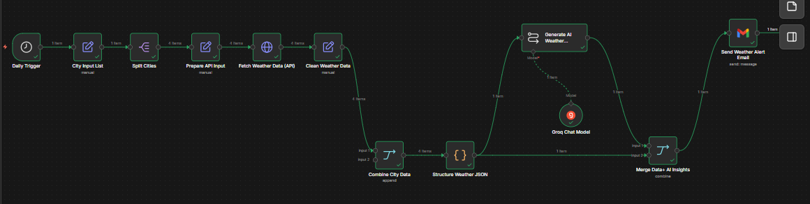

# AI Weather Risk Alert System

An automated workflow built using **n8n** that fetches real-time weather data, analyzes potential risks using AI, and sends email alerts.

---

## Features

* Real-time weather data using API
* AI-based risk detection
* Automated email alerts (Gmail API)
* Fully automated workflow (n8n)

---

## Tech Stack

* n8n
* Weather API
* Gmail API
* AI / LLM

---

## Workflow

---

## How It Works

1. Trigger starts workflow
2. Weather API fetches data
3. AI analyzes risk
4. Email alert is sent

---

## Use Case

* Weather alerts
* Automation projects
* AI + API integration demo

---

## Author

Sheeba Rashid
